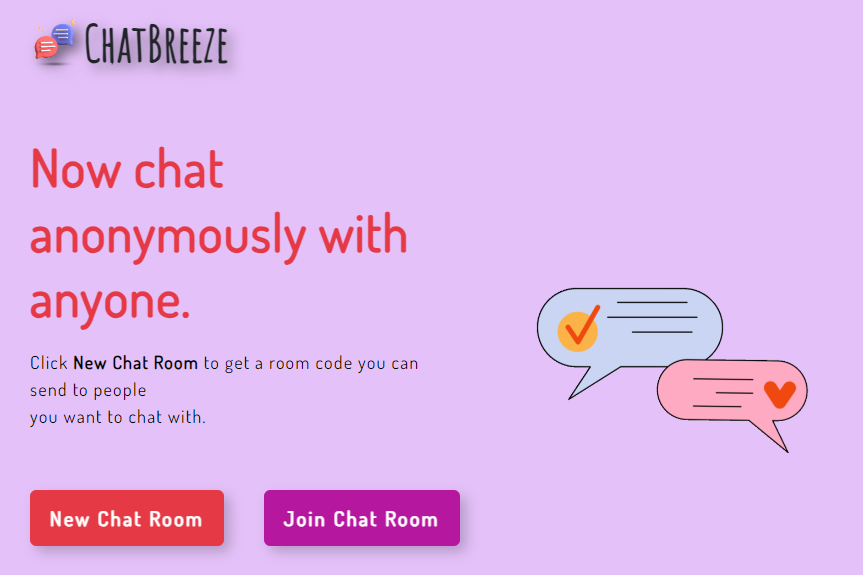
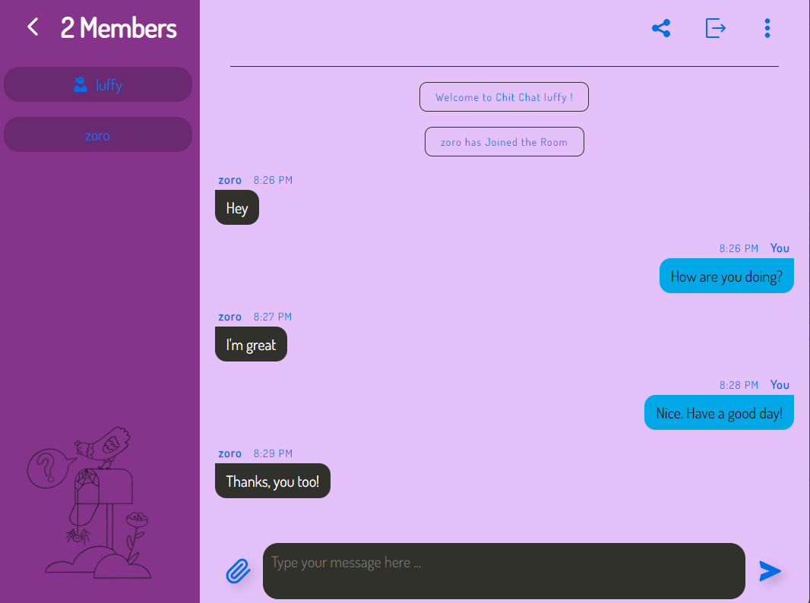

# ChatBreeze - A Real-Time Chat Application

### A chat app where users can join different rooms and send messages.

Check it out: https://chatbreeze.netlify.app

### Technologies used:
- HTML
- CSS
- JavaScript
- Socket IO
- React JS

### Things I learned while making this project:
- Real-time communication
- Event-driven programming.

---

